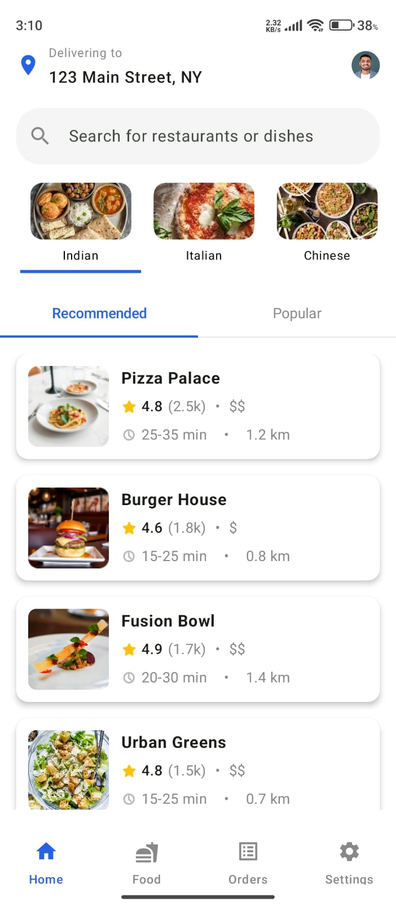

# 🍔 FoodOrder - Android Food Delivery App

A static food ordering Android application UI built using **Kotlin** and **Jetpack Compose**.
---

## 📸 Preview 

<table>
  <tr>
    <td align="center">
      <strong>📸 Image</strong><br>
      
    </td>
    <td align="center">
      <strong>🎥 Video</strong><br>
      
    </td>
  </tr>
</table>

## 🚀 Features

- ✨ Modern UI with Jetpack Compose  
- 📸 Image loading with Coil  
- 📱 Fully responsive and clean design  

---

## 🛠️ Built With

- **Kotlin**
- **Jetpack Compose**
- **Coil (Image Loading)**
- **Navigation Component (Compose)**

---

## 🧑‍💻 Getting Started

### Prerequisites

- Android Studio Giraffe or later
- Android SDK 33+
- Firebase project (with Authentication & Firestore enabled)

### Setup

1. **Clone the repo**
   ```bash
   git clone https://github.com/ayaxan7/FoodOrder.git
   cd FoodOrder
